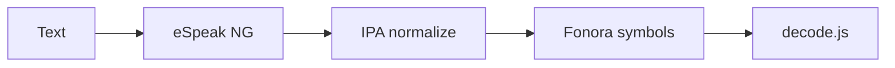

# Fonora — Phonetic Symbol Research Tool

A lightweight single-page web app for testing an experimental phonetic writing system. This is a research tool, not a constructed-language game.

## Architecture

```
Text → eSpeak NG → IPA → ipa-normalize.js → encodeSounds() → Fonora symbols
```

Fonora is language-agnostic. English, Spanish, French, German, Japanese, Arabic, Mandarin, and more flow through the same pronunciation layer.



## What it does

- Loads symbol rules from `language-rules.md` at runtime
- IPA pipeline: eSpeak NG → IPA → Fonora phonemes → symbols
- Symbol keyboard with number/letter shortcuts and clickable buttons
- Place × manner sound grid
- Live decode panel with spacing normalization
- Reverse sound → symbol lookup
- Simple decode/construct quiz mode for all encodable sounds (session stats only)
- Mini dictionary with localStorage persistence
- Translator with language selection
- Pronunciation Testing tab for IPA → Fonora evaluation

## Run locally

Install dependencies (copies eSpeak NG WASM to `vendor/espeak-ng/`):

```bash
cd fonora
npm install
python3 -m http.server 8000
```

Then open [http://localhost:8000](http://localhost:8000).

Browsers block `fetch()` and WASM loading when opening HTML files directly (`file://`). Always use a local HTTP server.

## Editing rules

Edit `language-rules.md` and reload the browser. Changes to symbols, keyboard mappings, sounds, labels, and undefined cells update automatically.

If the Markdown file cannot be loaded, the app shows a warning banner and most features are unavailable until the file loads successfully.

## eSpeak NG

See [docs/espeak-integration.md](docs/espeak-integration.md) for voice codes, WASM setup, GPL license note, and browser compatibility.

## Dictionary

Glossary entries are stored in browser `localStorage` under the key `fonora-glossary-v1`. Dictionary entries override the IPA pipeline for known words.

## Files

| File | Purpose |
|------|---------|
| `index.html` | Single-page UI |
| `app.css` | Layout and symbol rendering |
| `js/ipa.js` | eSpeak NG wrapper (canonical pronunciation source) |
| `js/ipa-normalize.js` | IPA → Fonora phoneme reduction |
| `js/ipa-to-fonora.js` | Phonemes → symbols via `language-rules.md` |
| `js/ipa-pipeline.js` | IPA pipeline orchestration |
| `js/language-preferences.js` | Language selection persistence |
| `js/load-language-rules.js` | Parse `language-rules.md`, build symbol registry |
| `js/symbol-compose.js` | Compose grid, vowels, and derived sounds from primaries |
| `js/fonora-config.js` | Active rules bundle for app and IPA pipeline |
| `js/rules.js` | Rule helpers (encode/decode entry lists) |
| `js/encode.js` | Sounds → Fonora symbols |
| `js/decode.js` | Fonora symbols → sounds (longest-match) |
| `js/encoder-testing.js` | Pronunciation Testing tab UI |
| `js/encoder-test-sets.js` | Curated and multilingual test word lists |
| `js/app.js` | UI wiring |
| `js/tests.js` | Node test runner |
| `js/tests-core.js` | Shared unit tests (browser + Node) |
| `language-rules.md` | Authoritative Fonora symbol mapping (human-editable) |
| `docs/espeak-integration.md` | eSpeak NG integration details |

## Tests

```bash
npm test
npm run test:vowels          # vowel readability report → reports/
npm run test:v2-collisions   # vowel minimal-pair collision report → reports/
```

Or open the app with `?test` in the URL to log test results in the browser console.

## Rule sections loaded from Markdown

- Places (5), Modifiers (4), Sound Grid
- Writing Conventions (derived symbols — e.g. `⊇` Vowel Carrier)
- Vowels (primary/alternate planes with Vowel Carrier shorthand)
- Derived Sounds (`th`, `dh`, `z` defined; `v` experimental)
- IPA Supplemental Mappings (diphthongs and rhotic schwa)
