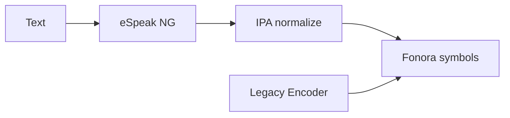

# Fonora — Phonetic Symbol Research Tool

A lightweight single-page web app for testing an experimental phonetic writing system. This is a research tool, not a constructed-language game.

## Architecture

**Preferred (IPA pipeline):**

```
Text → eSpeak NG → IPA → ipa-normalize.js → encodeSounds() → Fonora symbols
```

**Legacy (comparison only):**

```
English spelling → normalize.js (Legacy Encoder) → encodeSounds() → Fonora symbols
```

The IPA pipeline is language-agnostic and supports English, Spanish, French, German, Japanese, Arabic, and Mandarin through one pronunciation layer. The Legacy Encoder remains available for side-by-side comparison during migration.



## What it does

- Loads symbol rules from `language-rules.md` at runtime
- **IPA pipeline (default):** eSpeak NG → IPA → Fonora phonemes → symbols
- **Legacy Encoder:** English spelling rules for comparison
- Symbol keyboard with number/letter shortcuts and clickable buttons
- Place × manner sound grid
- Live decode panel with spacing normalization
- Reverse sound → symbol lookup
- Simple decode/construct quiz mode (session stats only)
- Mini dictionary with localStorage persistence
- Translator with encoder mode toggle and legacy comparison panel
- Pronunciation Testing tab for IPA → Fonora evaluation

## Run locally

Install dependencies (copies eSpeak NG WASM to `vendor/espeak-ng/`):

```bash
cd fonora
npm install
npm start
```

Then open [http://localhost:8000](http://localhost:8000).

`vendor/espeak-ng/` is generated by `npm install` and is not committed to git — run install after cloning.

Browsers block `fetch()` and WASM loading when opening HTML files directly (`file://`). Always use a local HTTP server.

## Deploy to Heroku

Requires the [Heroku CLI](https://devcenter.heroku.com/articles/heroku-cli) and a Heroku account.

```bash
heroku login
heroku create
git push heroku main
heroku open
```

Heroku runs `npm install` (which copies eSpeak NG into `vendor/`) and then `npm start` (`server.js` on `$PORT`). The `Procfile` declares the web process.

## Editing rules

Edit `language-rules.md` and reload the browser. Changes to symbols, keyboard mappings, sounds, labels, and undefined cells update automatically.

Edit `encoder-rules.md` to understand the **Legacy Encoder** (English → sound normalization). Legacy behavior is implemented in `js/normalize.js`.

If the Markdown file cannot be loaded, the app falls back to embedded rules and shows a warning banner.

## eSpeak NG

See [docs/espeak-integration.md](docs/espeak-integration.md) for voice codes, WASM setup, GPL license note, and browser compatibility.

## Dictionary

Glossary entries are stored in browser `localStorage` under the key `fonora-glossary-v1`. Two sample entries are added on first visit and can be deleted.

## Files

| File | Purpose |
|------|---------|
| `index.html` | Single-page UI |
| `app.css` | Layout and symbol rendering |
| `js/ipa.js` | eSpeak NG wrapper (canonical pronunciation source) |
| `js/ipa-normalize.js` | IPA → Fonora phoneme reduction |
| `js/ipa-to-fonora.js` | Phonemes → symbols via `language-rules.md` |
| `js/ipa-pipeline.js` | IPA pipeline orchestration |
| `js/encoder-mode.js` | Encoder mode preferences |
| `js/rules.js` | Parse `language-rules.md`, rule helpers |
| `js/normalize.js` | Legacy Encoder — English spelling → sounds |
| `js/encode.js` | Sounds → Fonora symbols |
| `js/decode.js` | Fonora symbols → sounds (longest-match) |
| `js/encoder-pipeline.js` | Legacy Encoder pipeline + debug stages |
| `js/encoder-testing.js` | Pronunciation Testing tab UI |
| `js/encoder-test-sets.js` | Curated and multilingual test word lists |
| `js/app.js` | UI wiring |
| `js/tests.js` | Unit tests |
| `language-rules.md` | Authoritative Fonora symbol mapping (human-editable) |
| `encoder-rules.md` | Legacy Encoder spec (human-editable) |
| `server.js` | Static HTTP server for local dev and Heroku |
| `Procfile` | Heroku web process (`npm start`) |
| `scripts/copy-espeak.js` | Postinstall — copies eSpeak NG WASM to `vendor/` |
| `docs/espeak-integration.md` | eSpeak NG integration details |
| `docs/IPA-PIPELINE-REPORT.md` | Implementation report |

## Tests

```bash
npm test
```

Or open the app with `?test` in the URL to log test results in the browser console.

## Rule sections loaded from Markdown

- Places, Modifiers, Sound Grid
- Special Derived Sounds (defined)
- Experimental Vowel System (draft — marked experimental in UI)
- Experimental Derived Sounds (draft — e.g. `v` → `○⌔`)
