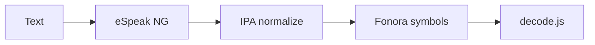

# Fonora — Phonetic Symbol Research Tool

A lightweight single-page web app for testing an experimental phonetic writing system. This is a research tool, not a constructed-language game.

## Architecture

```
Text → eSpeak NG → IPA → ipa-normalize.js → encodeSounds() → Fonora symbols
```

Fonora is language-agnostic. English, Spanish, French, German, Japanese, Arabic, Mandarin, and more flow through the same pronunciation layer.



Rules version: **v3** (`language-rules.md` — vowel grammar `⚬X`, diphthong `⚬X⌣Y`).

## What it does

- Loads symbol rules from `language-rules.md` at runtime
- IPA pipeline: eSpeak NG → IPA → Fonora phonemes → symbols (no dictionary bypass)
- **Keyboard** — symbol input, clickable buttons, and keyboard mapping table
- Place × manner sound grid
- **Alphabet** — primary symbol experiments + phoneme inventory (consonants, derived, vowels)
- Reverse sound → symbol lookup
- Decode/construct quiz (session stats; construct mode includes symbol keyboard)
- Translator with language selection and full-width editing
- Pronunciation Testing — manual IPA → Fonora review across languages
- Pronunciation Validation — automated encode/decode IPA round-trip testing

See [docs/README.md](docs/README.md) for the full documentation index.

## App navigation

| Section | Location | Purpose |
| --- | --- | --- |
| Translator | Primary nav | Text → IPA → Fonora; editable output |
| Sound Grid | Primary nav | Place × manner reference |
| Alphabet | Primary nav | Primary symbol overrides + phoneme inventory |
| Quiz | Primary nav | Decode or construct encodable sounds |
| Keyboard | More | Type symbols; mapping table |
| Reverse Lookup | More | Sound → symbol |
| Pronunciation Testing | More | Manual review + export |
| Pronunciation Validation | More | Automated IPA round-trip |

## Run locally

Install dependencies (copies eSpeak NG WASM to `vendor/espeak-ng/`):

```bash
cd fonora
npm install
npm start
```

Or: `python3 -m http.server 8000`

Then open [http://localhost:8000](http://localhost:8000).

Browsers block `fetch()` and WASM loading when opening HTML files directly (`file://`). Always use a local HTTP server.

## Editing rules

Edit `language-rules.md` and reload the browser. Changes to symbols, keyboard mappings, sounds, labels, and undefined cells update automatically.

If the Markdown file cannot be loaded, the app shows a warning banner and most features are unavailable until the file loads successfully.

## eSpeak NG

See [docs/espeak-integration.md](docs/espeak-integration.md) for voice codes, WASM setup, GPL license note, and browser compatibility.

## Files

| File | Purpose |
|------|---------|
| `index.html` | Single-page UI |
| `app.css` | Layout and symbol rendering |
| `js/ipa.js` | eSpeak NG wrapper (canonical pronunciation source) |
| `js/ipa-normalize.js` | IPA → Fonora phoneme reduction |
| `js/ipa-to-fonora.js` | Phonemes → symbols via `language-rules.md` |
| `js/ipa-pipeline.js` | IPA pipeline orchestration |
| `js/language-preferences.js` | Language selection persistence |
| `js/load-language-rules.js` | Parse `language-rules.md`, build symbol registry |
| `js/symbol-compose.js` | Compose grid, vowels, and derived sounds from primaries |
| `js/fonora-config.js` | Active rules bundle for app and IPA pipeline |
| `js/rules.js` | Rule helpers (encode/decode entry lists) |
| `js/encode.js` | Sounds → Fonora symbols |
| `js/decode.js` | Fonora symbols → sounds (longest-match) |
| `js/alphabet-lab.js` | Alphabet tab UI |
| `js/alphabet-overrides.js` | localStorage primary symbol overrides |
| `js/collision-audit.js` | Symbol collision analysis |
| `js/encoder-testing.js` | Pronunciation Testing tab UI |
| `js/pronunciation-validation.js` | Pronunciation Validation core logic |
| `js/pronunciation-validation-ui.js` | Pronunciation Validation tab UI |
| `js/encoder-test-sets.js` | Curated and multilingual test word lists |
| `js/app.js` | UI wiring |
| `js/tests.js` | Node test runner |
| `js/tests-core.js` | Shared unit tests (browser + Node) |
| `language-rules.md` | Authoritative Fonora symbol mapping (human-editable) |
| `docs/README.md` | Documentation index |
| `docs/ipa-normalize.md` | Consonant IPA map (grid + supplemental) |

## Tests

```bash
npm test                              # 48 unit/integration assertions
npm run test:vowels                   # vowel readability report → reports/
npm run test:minimal-pairs          # minimal-pair distinctness report → reports/
npm run test:v2-collisions          # deprecated alias for test:minimal-pairs
npm run audit:collisions            # full collision audit → docs/FONORA_COLLISION_AUDIT.md
npm run test:pronunciation-validation # IPA round-trip batch report → reports/
```

| Command | UI equivalent |
| --- | --- |
| `npm test` | Append `?test` to the app URL (results in browser console) |
| `npm run test:pronunciation-validation` | Pronunciation Validation tab (batch + single word) |
| `npm run test:vowels`, `test:minimal-pairs`, `audit:collisions` | CLI/report only |

See [docs/pronunciation-validation.md](docs/pronunciation-validation.md) for validation semantics.

## Rule sections loaded from Markdown

- Places (5), Modifiers (vowel indicator ⚬ + 4 manners), Sound Grid
- Vowels (v3 grammar: simple `⚬X`, diphthong `⚬X⌣Y`)
- Derived / Reserved Sounds (`th`, `dh`, `v`, `z` defined)
- IPA Supplemental Mappings (diphthongs and rhotic schwa)

## Known implementation notes

- Consonant IPA: grid/derived tokens auto-built from `language-rules.md`; supplemental variants in [docs/ipa-normalize.md](docs/ipa-normalize.md)
