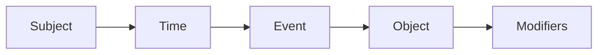
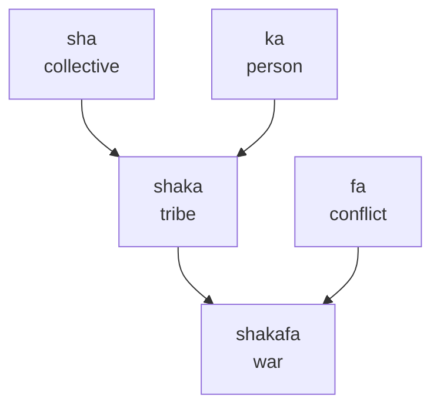
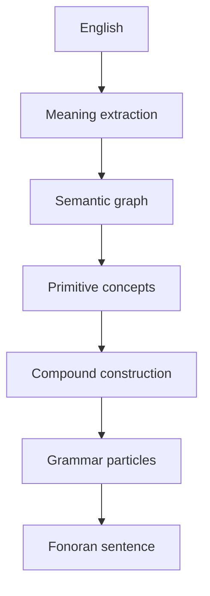

# Grammar

> **Status**: Living specification. This is the authoritative reference for humans and the future Fonoran Translator. Sections marked *Under Development* are intentional placeholders, not omissions.

Fonoran is not a language of words. It is a language of **concepts**.

Every lexical item represents a semantic concept. Grammar exists only to describe **relationships between concepts**. Complexity should live in semantic composition, not grammatical exceptions.

Read the examples first. You can already start understanding this language.

## Core Philosophy

Fonoran grammar deliberately avoids copying English or traditional linguistic categories.

### Concepts instead of parts of speech

There are no permanent nouns, verbs, or adjectives. Only concepts that take on roles from context.

```example
mi la kaso

I present love

↓

I love.
```

- **mi** = I (placeholder pronoun, *Under Development*)
- **la** = present (placeholder particle, *Under Development*)
- **kaso** = love

Notice that **love never changes form**.

English requires: love, loves, loved, loving.

Fonoran simply uses **kaso**. Grammar communicates the relationship, not the word itself.

```example
mi ta shakafa

I past war

↓

I fought.
```

- **ta** = past (placeholder particle, *Under Development*)
- **shakafa** never changes
- The event stays identical regardless of tense

Concepts can also sit beside other concepts as modifiers:

```example
kaso ka

love person

↓

loving person
```

```example
kaso sha

love collective

↓

loving community
```

```example
kaso fa

love conflict

↓

conflict about love
```

The same concept, three different readings. No spelling change required.

### Composition instead of memorization

New meaning is built by stacking known concepts.

When you know **sha** (collective) and **ka** (person), **shaka** (tribe) should feel inevitable.

```example
sha ka

collective person

↓

tribe
```

You did not memorize a new word. You read a relationship.

### No irregular grammar

Words never inflect. Relationships never hide inside spelling changes.

```example
mi ta kaso
mi la kaso

I past love
I present love

↓

I loved.
I love.
```

**kaso** stays **kaso** in both sentences.

### Minimal syntax

The surface grammar stays small on purpose. One predictable sentence skeleton carries most of the work.

```text
Subject · Time · Event · Object · Modifiers
```

Richness lives in concepts and particles, not in dozens of construction rules.

### Transparent meaning

Reading a compound should reveal its ancestry.

```example
shaka fa

tribe conflict

↓

war
```

**shakafa** is not an opaque token. It is **shaka** (tribe) in relation to **fa** (conflict). The spelling is a compressed semantic tree.

## Rule 1: Concepts Are Universal

Every word is simply a **concept**.

| Concept | Meaning |
| --- | --- |
| **ka** | person |
| **fa** | conflict |
| **sha** | collective |
| **kaso** | love |
| **shaka** | tribe |
| **shakafa** | war |

These are not permanently nouns or verbs. Their role depends on **sentence position** and **surrounding particles**.

```example
ka fa

person conflict

↓

a person's conflict
```

```example
fa ka

conflict person

↓

conflict involving a person
```

Same concepts. Different order. Different relationship.

## Rule 2: Words Never Change

Fonoran has no conjugation, declension, grammatical gender, plural endings, or case endings.

A word is always written the same way.

**shakafa** always remains **shakafa**.

```example
mi ta shakafa
mi la shakafa
sha la shakafa

I past war
I present war
collective present war

↓

I fought.
There is war.
The tribe is at war.
```

Time, plurality, and relationships are expressed through **particles** and **word order**, not through mutating the concept itself.

## Rule 3: Grammar Uses Particles

Instead of modifying words, Fonoran uses small **invariant particles** to mark grammatical relationships.

The particle inventory is not finalized. Placeholders below show the intended architecture.

| Role | Particle | Status |
| --- | --- | --- |
| Past | ta | Under Development |
| Present | la | Under Development |
| Future | TBD | Under Development |
| Question | TBD | Under Development |
| Negation | TBD | Under Development |
| Possession | TBD | Under Development |
| Location | TBD | Under Development |
| Direction | TBD | Under Development |
| Comparison | TBD | Under Development |

Even before the full inventory exists, you can already read sentences by treating each slot as a labeled relationship:

```example
mi la kaso ka

I present love person

↓

I love someone.
```

Particles are separate from concepts. They never fuse into word spellings.

## Rule 4: Fixed Word Order

Fonoran recommends a **default sentence structure**:

```text
Subject · Time · Event · Object · Modifiers
```



**Why this order:**

- **Predictable**: every clause follows the same skeleton
- **Machine friendly**: parsers do not need probabilistic reordering
- **Easy to learn**: one template instead of many constructions
- **Easy to parse**: slot-based analysis maps cleanly to a semantic graph

```example
shaka la shakafa

tribe present war

↓

The tribe is at war.
```

```example
mi la kaso shaka

I present love tribe

↓

I love the tribe.
```

Modifiers attach to the nearest eligible slot unless a future particle specifies otherwise (*Under Development*).

## Rule 5: Semantic Compounding

Almost every complex concept should be expressed through **composition**.

**Step 1: combine primitives**

| | |
| --- | --- |
| **sha** | collective |
| **ka** | person |

↓

| | |
| --- | --- |
| **shaka** | tribe |

**Step 2: extend the tree**

| | |
| --- | --- |
| **shaka** | tribe |
| **fa** | conflict |

↓

| | |
| --- | --- |
| **shakafa** | war |

Every derived word **preserves its ancestry**. Words form a semantic tree rather than existing independently.



Compounding rules for the translator: prefer the **shortest transparent path** through approved concepts; reject opaque shortcuts that break the tree (*implementation Under Development*).

## Rule 6: Meaning Is Visible

When someone learns **sha** (collective) and **ka** (person), they should naturally understand **shaka** (tribe) without memorization.

```example
sha ka

collective person

↓

tribe
```

```example
shaka fa

tribe conflict

↓

war
```

As vocabulary grows, **understanding accelerates**. Each new root unlocks many compounds, and each compound reinforces the roots below it.

Teaching order should follow the semantic tree (roots, then compounds, then sentences), not frequency lists copied from English.

## Rule 7: Translator Architecture

The Fonoran Translator must **not** perform literal word substitution.

English surface forms diverge. Meaning converges. The translator **compiles meaning into Fonoran**.



**Pipeline stages:**

1. **English**: arbitrary phrasing, idioms, reorderings
2. **Meaning extraction**: normalize to language-neutral propositions
3. **Semantic graph**: entities, events, relations, time, negation
4. **Primitive concepts**: map graph nodes to approved Fonoran roots
5. **Compound construction**: build or select transparent compounds for complex nodes
6. **Grammar particles**: attach tense, question, possession, etc. (*Under Development*)
7. **Fonoran sentence**: emit fixed-order surface string

### Undefined concepts

Whenever a concept cannot yet be expressed in Fonoran, the translator must show it in **red**. Never silently omit it. Never substitute English without marking it as unresolved.

> Red words indicate concepts that do not yet exist in the Fonoran lexicon.

Unknown concepts are valuable. They reveal where the language needs to grow. As the language grows, fewer words will appear in red.

The translator should function as a **language development tool**, not just a translation tool.

### Example: vocabulary gap

```pipeline
English:
I love my family.

Semantic:
I
present
love
family

Fonoran:
mi
la
kaso
[family]
```

**mi**, **la**, and **kaso** compile cleanly. **[family]** is shown in red because no approved concept exists yet.

### Example: full compile

```pipeline
English:
The tribe is at war.

Semantic:
tribe
present
war

Fonoran:
shaka
la
shakafa
```

Every known concept compiles into Fonoran. **shaka** (tribe), **la** (present), **shakafa** (war). Nothing hidden. Nothing borrowed from English without marking it.

This architecture allows multiple English expressions to converge into the **same underlying semantic representation**, then diverge again only at the particle layer when needed.

**Non-goals for v1:**

- word-for-word English order preservation
- inflection mimicry
- opaque lexical lookup when a compound path exists

## Future Work

The following topics are **intentionally incomplete**. They will extend this specification without breaking Rules 1 through 7.

- Pronouns
- Tense particles
- Aspect
- Negation
- Questions
- Comparisons
- Numbers
- Quantifiers
- Time expressions
- Locations
- Conditionals
- Relative clauses

Contributions should preserve: invariant words, particle-based grammar, fixed default order, and visible semantic compounding.

*Related: [Fonoran language lab](fonoran.md) · [Dictionary](/fonoran/#dictionary)*
