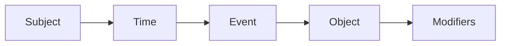
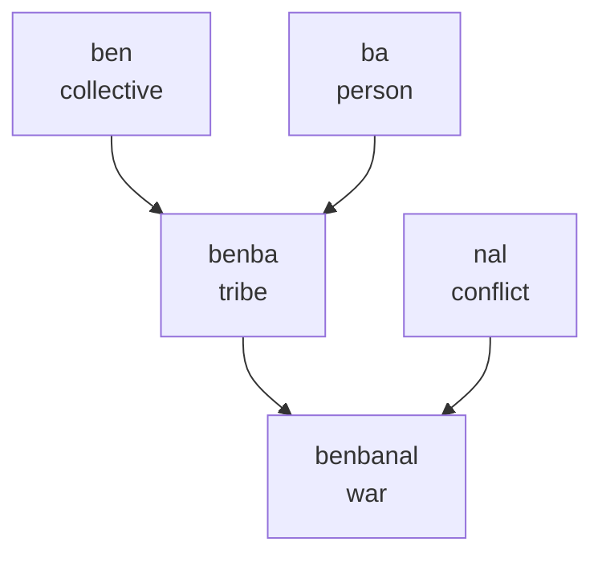
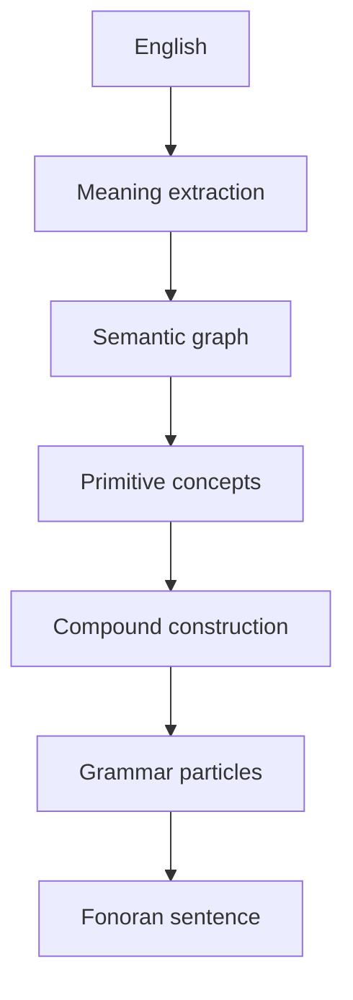

# Grammar

> **Status**: Living specification. This is the authoritative reference for humans and the future Fonoran Translator. Sections marked *Under Development* are intentional placeholders, not omissions.
>
> **Read [the Fonoran Constitution](fonoran-constitution.md) first.** It states what
> Fonoran is *for*: an experiment in whether people from different native languages can
> communicate by combining a small shared set of roots. Compounds are **meaning-attempts**,
> not canonical answers; the test for any expression is *"if someone only knew the roots,
> would this probably help them recover the intended meaning?"* This grammar describes the
> minimal machinery that makes those attempts mutually intelligible.

Fonoran is a language of **concepts**.

Every lexical item represents a semantic concept. Grammar exists only to describe **relationships between concepts**. Complexity should live in semantic composition, not grammatical exceptions.

Roots are organized by **human experience** (survival/body, space/motion, social, emotion,
time, thinking, abstract) and gated by the **campfire test**: *could two strangers stranded
with no common language plausibly need this root in their first week?* If yes, it belongs in
the communicative core; if no, it belongs in the extended or complete vocabulary. See the
[constitution](fonoran-constitution.md) for the tiered language model (~50 core → ~100
extended → unlimited).

### The fundamental experience test

> **A primitive concept should represent a fundamental human experience that cannot be naturally expressed using simpler Fonoran concepts.**

This is inspired by how toddlers learn language, but it is **not** a literal toddler vocabulary test. A two-year-old may not yet grasp **equal**, **before**, or **remember**, yet every language needs them. The test is whether *any* speaker could naturally understand the concept only after knowing simpler Fonoran roots, not whether a child already has the English word.

| Question | If yes → | If no → |
| --- | --- | --- |
| Can this be naturally expressed using simpler Fonoran concepts? | **Compound** or **grammar particle** | Candidate primitive |
| Is this a dimension of reality (not a word slot)? | Strong primitive signal | Reconsider |
| Is this causal linking (because / therefore)? | **Grammar particle** | n/a |

```example
ben ba

collective person

↓

benba (tribe)
```

```example
je + cha

big + change

↓

jecha (grow)
```

```example
hu + di

know + before

↓

hudi (remember)
```

```example
ye (water)

(no simpler Fonoran explanation)

↓

primitive
```

The full proposed primitive inventory lives in [fonoran-semantic-foundation.md](fonoran-semantic-foundation.md).

Read the examples first. You can already start understanding this language.

## Core Philosophy

> **Fonoran minimizes lexical categories and represents sentences as relationships between invariant concepts.**

Fonoran grammar deliberately avoids copying English or traditional linguistic categories. Every lexical item is an **invariant concept**. Its role in a sentence comes from **grammar particles** and **sentence position**, not from noun, verb, or adjective labels.

### Concepts instead of parts of speech

There are no permanent nouns, verbs, or adjectives. Only concepts that take on roles from context.

```example
mi bem

↓

I love.
```

- **mi** = I (placeholder pronoun, *Under Development*)
- **bem** = love

Notice that **love never changes form**.

English requires: love, loves, loved, loving.

Fonoran simply uses **bem**. Grammar communicates the relationship, not the word itself.

```example
mi ta bem

↓

I loved.
```

- **ta** = past (*Under Development*)
- **bem** never changes

```example
mi sa bem

↓

I will love.
```

- **sa** = future (*Under Development*)
- The event concept stays identical regardless of tense

```example
mi ta benbanal

↓

I fought.
```

- **benbanal** never changes
- Only **ta** marks that the event is in the past

Concepts can also sit beside other concepts as modifiers:

```example
bem ba

love person

↓

loving person
```

```example
bem ben

love collective

↓

loving community
```

```example
bem nal

love conflict

↓

conflict about love
```

The same concept, three different readings. No spelling change required.

### Composition instead of memorization

New meaning is built by stacking known concepts.

When you know **ben** (collective) and **ba** (person), **benba** (tribe) should feel inevitable.

```example
ben ba

collective person

↓

benba (tribe)
```

You did not memorize a new word. You read a relationship.

### No irregular grammar

Words never inflect. Relationships never hide inside spelling changes.

```example
mi ta bem
mi bem
mi sa bem

↓

I loved.
I love.
I will love.
```

**bem** stays **bem** in every sentence. Only **ta** or **sa** mark non-present time.

### Minimal syntax

The surface grammar stays small on purpose. One predictable sentence skeleton carries most of the work.

```text
Subject · Time · Event · Object · Modifiers
```

The **Time** slot is **empty for present**. Present is the default and is inferred from context. Only past (**ta**) or future (**sa**) need a particle.

### Transparent meaning

Reading a compound should reveal its ancestry.

```example
benba nal

tribe conflict

↓

benbanal (war)
```

**benbanal** is not an opaque token. It is **benba** (tribe) in relation to **nal** (conflict). The spelling is a compressed semantic tree.

## Rule 1: Concepts Are Universal

Every word is simply a **concept**.

| Concept | Meaning |
| --- | --- |
| **ba** | person |
| **nal** | conflict |
| **ben** | collective |
| **bem** | love |
| **benba** | tribe |
| **benbanal** | war |

These are not permanently nouns or verbs. Their role depends on **sentence position** and **surrounding particles**.

```example
ba nal

person conflict

↓

a person's conflict
```

```example
nal ba

conflict person

↓

conflict involving a person
```

Same concepts. Different order. Different relationship.

## Rule 2: Words Never Change

Fonoran has no conjugation, declension, grammatical gender, plural endings, or case endings.

A word is always written the same way.

**benbanal** always remains **benbanal**.

```example
mi ta benbanal
mi benbanal
benba benbanal

↓

I fought.
There is war.
The tribe is at war.
```

Present sentences omit the time particle. **benbanal** never changes.

Time, plurality, and relationships are expressed through **particles** and **word order**, not through mutating the concept itself.

## Rule 3: Grammar Uses Particles

Instead of modifying words, Fonoran uses small **invariant particles** to mark grammatical relationships.

The particle inventory is not finalized. Placeholders below show the intended architecture.

### Tense

Present is **not** a particle. It is the default when no time marker appears.

| Tense | Particle | Status |
| --- | --- | --- |
| Past | ta | Under Development |
| Future | sa | Under Development |

### Other particles

The full inventory (forms, roles, English triggers) lives in [../data/fonoran-grammar-particles.json](../data/fonoran-grammar-particles.json). The particle class is **closed and minimal**: a word is a particle only if it is genuinely grammatical (cannot be a lexical concept) *and* is sanctioned here or wired in the translator.

| Role | Particle | Status |
| --- | --- | --- |
| Negation | no | Active |
| Affirmation | ya | Active |
| Question (marker) | wo | Active |
| Conditional (if) | von | Active |
| Interrogative (what) | vus | Active |
| Interrogative (who) | zas | Active |
| Interrogative (when) | zes | Active |
| Interrogative (where) | zis | Active |
| Interrogative (why) | zos | Active |
| Interrogative (how) | zus | Active |
| Focus (only) | vat | Active |
| Focus (also) | vet | Active |
| Focus (even) | vit | Active |
| Possession | TBD | Under Development |
| Comparison | TBD | Under Development |

Particles are **reserved**: the root generator never assigns particle forms to a lexical concept. The reserved set is `mi`, `ta`, `sa`, `no`, `ya`, `wo` plus the `v*`/`z*` particle forms enumerated in [../data/fonoran-primitive-roots-config.json](../data/fonoran-primitive-roots-config.json) (`reserved_particles.forms`).

**Grammar vs. lexicon.** Spatial and relational meaning is *lexical*, not grammatical: "in/inside", "here/there", and the three sense of "toward" (`up`/`dal`, `down`/`nat`, `reach`/`ni`), plus `near`/`far`, are **concepts/roots**, never particles. Likewise, personal pronouns other than `mi` (you/we/they/he/she/it) resolve lexically, and conjunctions (`and`/`or`/`but`/`because`) are handled structurally as clause connectives rather than as emitted particles. This keeps the particle class small and prevents it from shadowing the lexicon.

Polarity is grammar, not vocabulary — **false** is `no` + **true**, **different** is `no` + **same**. Such antonyms are *not* roots and *not* compounds; they are produced at the particle layer.

### Particle placement and quantifiers

Particles occupy fixed positions within the sentence skeleton; they never fuse into adjacent spellings.

- **Negation** sits between Time and Event: `Subject · Time · no · Event · …` (e.g. *I never said that* -> `mi no` + event). It is clause-scoped.
- **Question marker** `wo` is clause-initial; a specific interrogative particle (e.g. `zes` for *when*) fills its slot in addition to the marker.
- **Focus** particles (`vat`/`vet`/`vit`) attach as modifiers next to the element they focus.
- **Quantifier pronouns compose** rather than taking their own root: *nobody* = `no` + **person**, *nothing* = `no` + **thing**, *everyone* = **all** + **person**, *everything* = **all** + **thing**, *someone* = **some** + **person**.

Even before the full inventory exists, you can already read sentences by treating each slot as a labeled relationship:

```example
mi bem ba

↓

I love someone.
```

Particles are separate from concepts. They never fuse into word spellings.

## Rule 4: Fixed Word Order

Fonoran recommends a **default sentence structure**:

```text
Subject · Time · Event · Object · Modifiers
```



**Why this order:**

- **Predictable**: every clause follows the same skeleton
- **Machine friendly**: parsers do not need probabilistic reordering
- **Easy to learn**: one template instead of many constructions
- **Easy to parse**: slot-based analysis maps cleanly to a semantic graph

```example
benba benbanal

↓

The tribe is at war.
```

```example
mi bem benba

↓

I love the tribe.
```

```example
mi sa bem benba

↓

I will love the tribe.
```

Modifiers attach to the nearest eligible slot unless a future particle specifies otherwise (*Under Development*).

## Rule 5: Semantic Compounding

Almost every complex concept should be expressed through **composition**.

**Step 1: combine primitives**

| | |
| --- | --- |
| **ben** | collective |
| **ba** | person |

↓

| | |
| --- | --- |
| **benba** | tribe |

**Step 2: extend the tree**

| | |
| --- | --- |
| **benba** | tribe |
| **nal** | conflict |

↓

| | |
| --- | --- |
| **benbanal** | war |

Every derived word **preserves its ancestry**. Words form a semantic tree rather than existing independently.



Compounding rules for the translator: prefer the **shortest transparent path** through approved concepts; omit concepts implied by human experience unless emphasis or disambiguation is needed (**semantic economy**); reject opaque shortcuts that break the tree (*implementation Under Development*).

### Compound Boundary Constraint

> **A valid compound may not join two morphemes when the final consonant of the left morpheme is identical to the initial consonant of the right morpheme. Fonoran does not collapse, lengthen, or silently alter boundary sounds. If such a boundary would occur, the compound candidate is invalid and must be regenerated or assigned different roots.**

This rule preserves Fonoran's core promise: **what you hear = what you write = what you look up**. If a spoken compound sounded like "bemam" a listener would naturally write "bemam", but the dictionary would store "bemmam". That gap violates spelling stability.

| Left | Right | Boundary | Valid? | Reason |
| --- | --- | --- | --- | --- |
| bem | mam | m + m | **No** | identical consonants |
| kal | lem | l + l | **No** | identical consonants |
| bem | lek | m + l | Yes | different consonants |
| ben | mam | n + m | Yes | different consonants |
| ba | so | a + s | Yes | vowel–consonant boundary |
| so | a | o + a | Yes | vowel–vowel boundary |

**This is a generation constraint, not a pronunciation rule.** Fonoran never collapses, lengthens, or silently alters boundary sounds. The constraint prevents generating compounds that would require hidden spelling or pronunciation exceptions.

Multi-part compounds must satisfy the constraint at **every boundary**, not just the first one.

The constraint is enforced at:
- **Root generation** (`fonoran-root-boundary-score.js`) — when a root is assigned a spelling, candidate forms are scored against the root's likely compound partners; forms that would create boundary collisions are penalized and any remaining risk is surfaced as a warning in Review (`compound_flow_score` + `boundary_warnings`).
- **Build time** (`npm run fonoran:build`) — curated compounds that violate it are dropped with a clear reason.
- **Word composer UI** — saving is blocked and the violation is shown inline.
- **API** (`POST /api/fonoran/lab/compounds`) — the server rejects the request with a descriptive error.

### Semantic economy

Fonoran compounds should contain only the concepts necessary to distinguish their intended meaning. Concepts that are naturally implied by human experience should be omitted unless the speaker wishes to emphasize or disambiguate them.

The goal is not to create exhaustive definitions, but to represent the **minimum semantic ingredients** required to identify a concept.

```example
against + air

↓

air resistance, wind resistance, drag

(motion is implied — move is unnecessary)
```

```example
against + move + water

↓

resistance encountered while moving through water (hydrodynamic drag)

(move intentionally narrows the meaning)
```

This gives the language a natural property:

- **Fewer roots** → broader, more general concepts
- **More roots** → narrower, more precise concepts

This principle should guide both manual word creation and future automated compound generation.

## Rule 6: Meaning Is Visible

When someone learns **ben** (collective) and **ba** (person), they should naturally understand **benba** (tribe) without memorization.

```example
ben ba

collective person

↓

benba (tribe)
```

```example
benba nal

tribe conflict

↓

benbanal (war)
```

As vocabulary grows, **understanding accelerates**. Each new root unlocks many compounds, and each compound reinforces the roots below it.

Teaching order should follow the semantic tree (roots, then compounds, then sentences), not frequency lists copied from English.

## Rule 7: Translator Architecture

The Fonoran Translator must **not** perform literal word substitution.

English surface forms diverge. Meaning converges. The translator **compiles meaning into Fonoran**.



**Pipeline stages:**

1. **English**: arbitrary phrasing, idioms, reorderings
2. **Meaning extraction**: normalize to language-neutral propositions
3. **Semantic graph**: entities, events, relations, time, negation
4. **Primitive concepts**: map graph nodes to approved Fonoran roots
5. **Compound construction**: build or select transparent compounds for complex nodes
6. **Grammar particles**: attach past (**ta**), future (**sa**), question, possession, etc. (*Under Development*). **Omit time particles for present.**
7. **Fonoran sentence**: emit fixed-order surface string

Full implementation spec: [fonoran-interpretive-translator.md](fonoran-interpretive-translator.md).

**Default tense rule:** if the semantic frame has no time particle, the translator treats the sentence as **present** (or contextually current). Only **ta** (past) and **sa** (future) appear on the surface.

Whenever a concept cannot yet be expressed in Fonoran, the translator must show it in **red**. Never silently omit it. Never substitute English without marking it as unresolved.

> Red words indicate concepts that do not yet exist in the Fonoran lexicon.

Unknown concepts are valuable. They reveal where the language needs to grow. As the language grows, fewer words will appear in red.

The translator should function as a **language development tool**, not just a translation tool.

### Resolution cascade & honest gaps

Each English token is resolved through an ordered cascade. The first legitimate
match wins; if none matches, the token is an **honest gap** (red) — the
translator never fabricates a spelling.

| Tier | `resolution_kind` | Quality | Notes |
| --- | --- | --- | --- |
| Curated alias | `direct` | pass | Concept id, localized alias, or lab meaning/alias. |
| Interpretation rule | `interpreted` | pass | Tense lemmas, idioms, spatial/relational frames, pronoun hints. |
| Nearest existing root | `semantic` | review | A real WordNet hypernym that already has a root. Single concept only. |
| Weak (gloss) alias | `alias_weak` | review | Alias derived from a concept's *description* text (low confidence). |
| Unresolved | `unknown` | gap | No legitimate match — surfaces in red for the designer to grow a root. |

**Strong vs weak aliases.** An alias is **strong** when it comes from a curated
source: the concept id, its localized aliases, or a lab sound's meaning/curated
aliases. An alias is **weak** when it is merely a token from a concept's
*description gloss* (e.g. `dark`'s gloss "no light" leaks the token `light`).
Weak aliases can **never shadow** a strong root, regardless of registration
order, and they resolve as `alias_weak` (low confidence) so the quality gate can
flag mismatches like the old `travel → path` and `light → dark` errors.

**No generated guesses.** The translator does not invent multi-root compounds
for unknown words. The standalone Word Generator has been removed; the only
non-curated tier is the single-concept `semantic` fallback to an *existing*
root. Anything else is an honest gap.

**Meaningful function words.** Relational words that carry meaning are not
blanket-skipped: e.g. `from` resolves to the `source` root rather than being
dropped. Only truly contentless articles/possessives/conjunctions are skipped.
Second-person **`you`** resolves lexically to the **`addressee`** root (**`ti`**), symmetric to **`self`** (**`de`**) for the speaker.

### Golden regression suite

[../data/fonoran-translation-tests.json](../data/fonoran-translation-tests.json)
is a **golden corpus**: ~100 canonical English sentences (11 levels), each with
the exact `fon` (roman) output the project commits to, plus a `note` recording
known gaps/decisions. It is the permanent regression snapshot — run it on every
grammar, root, or rule change:

```bash
npm run test:translator          # assert: FAIL on any drift or new gap
npm run test:translator:update   # accept current output as the new golden baseline
node scripts/fonoran-translation-gaps.js   # full human report (coverage, gaps, collapses)
```

The runner also grades resolution quality (pass / review / gap) and reports
**concept collapses** — distinct English words sharing one root (e.g.
`man`, `woman`, `baby → ba`) — so the designer can decide whether a concept
needs its own root. `npm test` runs this suite automatically.

### Example: love and family

```pipeline
English:
I love my family.

Semantic:
I
love
family

Fonoran:
mi
bem
tatba
```

**family** compiles to **tatba** (bond + person). No time particle: present by default. Every slot resolves through known concepts or transparent compounding.

```example
tat ba

bond person

↓

tatba (family)
```

### Example: full compile

```pipeline
English:
The tribe is at war.

Semantic:
tribe
war

Fonoran:
benba
benbanal
```

Every known concept compiles into Fonoran. **benba** (tribe), **benbanal** (war). No time particle: the tribe **is at war now**. Nothing hidden. Nothing borrowed from English without marking it.

This architecture allows multiple English expressions to converge into the **same underlying semantic representation**, then diverge again only at the particle layer when needed.

**Non-goals for v1:**

- word-for-word English order preservation
- inflection mimicry
- opaque lexical lookup when a compound path exists

## Semantic coordinates

Every word in Fonoran carries three internal coordinates called **depth**, **mode**, and **aspect**. Together they form a compact address in semantic space — where a concept sits relative to others.

| Coordinate | What it captures | Example values |
| --- | --- | --- |
| **Depth** | How abstract or concrete the concept is | `interface`, `index`, `junction`, `emanation`, `origin` |
| **Mode** | How the concept moves or acts in the world | `packet`, `live`, `flux`, `hollow`, `passage` |
| **Aspect** | How it relates to its surroundings | `contact`, `focal`, `field` |

You do not edit these coordinates directly. They are assigned automatically by the language lab — a process called **DDA inference** — and are an internal mapping layer, not something the language creator needs to manage word by word.

### How coordinates are assigned

Coordinates start as **pending** the moment a root or compound is created. The lab infers them on demand using two signals:

1. **Sound shape** — the onset consonant and vowel of a syllable carry phonetic weight that maps loosely onto depth and mode. This gives a starting guess with moderate confidence.
2. **Meaning match** — the English gloss is matched against a reference inventory of 36 primitive concepts, each with authoritative coordinates. An exact match raises confidence significantly.

For **compound words**, the system blends the coordinates of each component root. The dominant depth comes from the first component; mode consolidates when multiple parts are combined.

After inference, each coordinate gets a **status**:

- `inferred` — assigned automatically, confidence below 80 %
- `confirmed` — high-confidence assignment (≥ 80 %)
- `stale` — the word's meaning or composition changed after the last inference; re-run DDA to refresh
- `pending` — not yet processed

### When to re-run

Coordinates go **stale** automatically whenever a word's meaning or recipe changes. The lab never silently overwrites them. To refresh stale coordinates, open the Advanced tab in the lab and click **Run DDA**.

Over time, coordinates that started as `inferred` can be locked in manually by confirming them — making the language progressively more stable as it matures.

### What the UI shows

The word detail view labels these as **Semantic coordinates**, not DDA. Non-technical users see the three named values — depth, mode, aspect — along with a note indicating whether the coordinate was matched by meaning, inferred from sound, or blended from parent words. A visual relationship chart shows how the parts of a compound word combine into its final coordinates.

## Future Work

The following topics are **intentionally incomplete**. They will extend this specification without breaking Rules 1 through 7.

- Pronouns
- Aspect
- Negation
- Questions
- Comparisons
- Numbers
- Quantifiers
- Time expressions
- Locations
- Conditionals
- Relative clauses

Contributions should preserve: invariant words, particle-based grammar, fixed default order, visible semantic compounding, and semantic economy in compounds.

*Related: [Fonoran language lab](fonoran.md) · [Semantic foundation](fonoran-semantic-foundation.md) · [Dictionary](/fonoran/#dictionary)*
