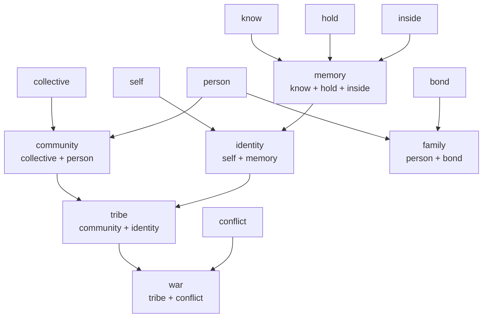
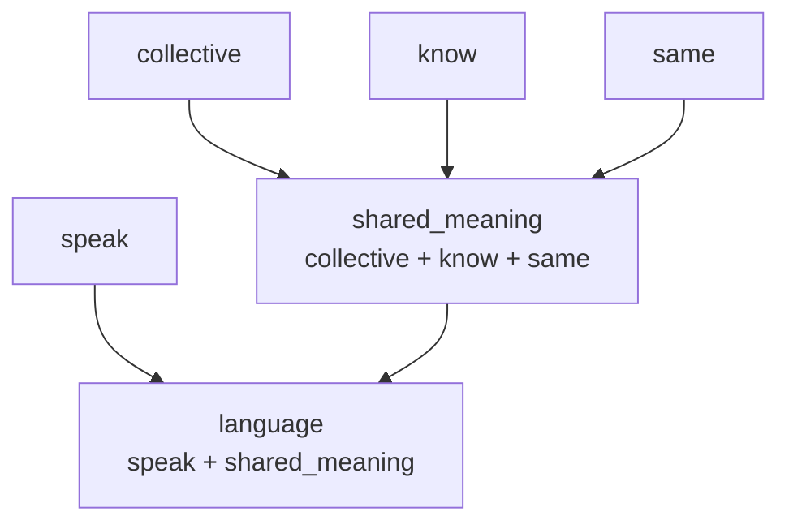
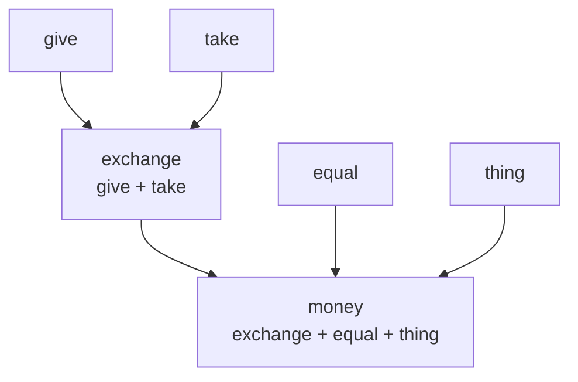

# Fonoran semantic foundation
> **Now a research note.** This document is preserved as a primary source. Related narrative in the research notebook: [RN-11 · The irreducible dimensions of meaning](/research/notes/semantic-foundation).


> **Status:** proposal v1.2 · **Superseded for phonetics** by [fonoran.md](fonoran.md) · Semantic inventory remains reference for compounds

This document supersedes the algorithmic primitive-roots experiment (`fonoran-primitive-roots.js`). That tooling assigned phonetic forms before semantic approval. **This foundation starts from concepts only.**

Authoritative grammar philosophy: [fonoran-grammar.md](fonoran-grammar.md)

Machine-readable inventories:

| File | Contents |
| --- | --- |
| [`data/fonoran-semantic-primitives.json`](../data/fonoran-semantic-primitives.json) | 99 primitive dimensions |
| [`data/fonoran-grammar-particles.json`](../data/fonoran-grammar-particles.json) | Grammar particles (separate from roots) |
| [`data/fonoran-semantic-demo-compounds.json`](../data/fonoran-semantic-demo-compounds.json) | 50 demonstration compounds (concept trees only) |

---

## Design principles

1. **Dimensions of reality, not a word list.** The goal is ~100 **semantic dimensions**: carved space from which compounds write themselves. Not 100 English words.
2. **Minimize lexical categories.** Fonoran represents sentences as relationships between invariant concepts. Avoid noun/verb/adjective framing in documentation and tooling.
3. **The fundamental experience test.** A primitive represents an experience that **cannot be naturally expressed using simpler Fonoran concepts.** Inspired by early language learning, but not limited to toddler cognition (equal, before, remember are primitives; run and useful are not).
4. **Grammar is separate.** Pronouns, tense, logic, causation (because / therefore), and relational particles are never lexical roots. Present tense has no particle.
5. **Phonetics come last.** No syllable assignments until this semantic inventory is approved.
6. **Hierarchical compounding.** Prefer `community + identity → tribe` over flattening intermediate concepts.
7. **Productive dimensions.** **thing**, **change**, **move**, **equal**, **strong**, and **bond** are high-leverage roots. Most compounds should flow from them naturally.

### The fundamental experience test (defining rule)

> **A primitive concept should represent a fundamental human experience that cannot be naturally expressed using simpler Fonoran concepts.**

| Misread (avoid) | Correct read |
| --- | --- |
| "Would a two-year-old say this word?" | "Can a speaker naturally understand this only from simpler Fonoran roots?" |
| Toddler vocabulary = primitive list | Early experience **informs** the test; adult-needed concepts (equal, before) still qualify |
| 100 common English words | 100 **dimensions of reality** |

**Not primitives (v1.2):** walk, useful, cause, effect, void — see demoted list in JSON.

**High-leverage primitives:** thing, change, move, equal, strong, bond, conflict, empty.

---

## Phase 1: 99 primitive dimensions

### Domain overview (v1.2)

| Domain | Count | Role |
| ---: | ---: | --- |
| being | 8 | person, self, collective, body, life… |
| action | 19 | **move**, give, take, **use**, **help**, speak, know… |
| ontology | 5 | **thing**, substance, form, **change**, **empty** |
| element | 11 | water, fire, earth, air… |
| space | 13 | inside, up, down, here, place… |
| time | 4 | **before**, **after**, now, time |
| quantity | 7 | one, many, all, some, **fast**… |
| emotion | 5 | love, fear, joy, pain, sad |
| evaluation | 5 | good, bad, true, false, **equal** |
| relationships | 6 | **bond**, **conflict**, same, different, part, whole |
| process | 10 | mark, flow, container, **strong**… |
| body | 4 | hand, eye, skin, bone |
| life | 1 | food |

### v1.2 changes from review

| Change | Reason |
| --- | --- |
| **Reframed toddler test** | Fundamental **experience** test; equal/before/remember stay primitive |
| **Removed walk** | Locomotion modality; **run** = move + fast, **swim** = move + water |
| **Removed useful** | **useful** = good + use |
| **Removed cause, effect** | **because** / **therefore** are grammar particles |
| **Removed void** | **empty** is primitive; nothing derives from empty |
| **Added use, help, empty, fast** | Action and absence dimensions |
| **Elevated thing + change** | Documented as most productive noun/process dimensions |

### Move (one dimension, many modalities)

| Compound | Tree |
| --- | --- |
| run | move + fast |
| swim | move + water |
| fly | move + air |
| vehicle | move + thing |
| road | path + move |

Walking is **not** primitive — it is one culturally specific way of moving.

### Thing (the primary noun dimension)

| Compound | Tree |
| --- | --- |
| book | knowledge + thing |
| meal | food + thing |
| vehicle | move + thing |
| lamp | light + thing |
| document | mark + thing + know |
| tool | thing + hand + useful → thing + hand + good + use |

### Change (transformation dimension)

| Compound | Tree |
| --- | --- |
| grow | life + change + more |
| damage | thing + change + bad |
| improve | thing + change + good |

### Equal and strong (productive evaluation/process)

**equal** → balance, fairness, exchange, symmetry, money (with exchange + thing)

**strong** → force, leader, government, weapon, healthy

### Causation is grammar

| English | Fonoran |
| --- | --- |
| because | grammar particle `logic_because` |
| therefore | grammar particle `logic_therefore` |

Humans link clauses with **because** / **therefore** — they do not often lexicalize "cause" as a noun.

### Empty, not void

| Concept | Path |
| --- | --- |
| empty | primitive |
| nothing | empty (or grammar_not + thing) |
| peace | collective + conflict + **empty** |
| forget | know + **empty** |

### Bond and conflict (productive roots)

**bond** unlocks: family, friend, home, law, religion

**conflict** unlocks: war, enemy, weapon (tool + conflict), peace (collective + conflict + empty)

### Self and identity

| Concept | Status | Path |
| --- | --- | --- |
| **self** | primitive | The speaker's own locus; "me" / "mine" |
| **memory** | compound | know + hold + inside |
| **identity** | compound | self + memory |
| **remember** | compound | know + before |
| **forget** | compound | know + empty |

### Demoted primitives

| Was primitive | Now | Compound path |
| --- | --- | --- |
| identity | compound | self + memory |
| value | excluded | good + want + equal (for "worth") |
| signal | excluded | speak and hear suffice |
| pattern | excluded | same + many + time |
| power | excluded | strong + do + person |

### Irreducibility rationale (selected)

#### Being & action

| Primitive | Fundamental experience test |
| --- | --- |
| **person** | Cannot explain without circularity. ✓ |
| **self** | Distinct from person — "me" vs "someone". ✓ |
| **water** | Experienced directly. ✓ |
| **move** | All locomotion inherits from this; walk/run/swim are modalities. ✓ |
| **use / help** | Employing things and aiding others are basic acts. ✓ |
| **give / take** | Core social acts. ✓ |
| **speak** | Prior to language (which adds shared meaning among many). ✓ |
| **before / after** | Needed for yesterday, tomorrow, remember — not toddler words, but irreducible. ✓ |

#### Ontology

| Primitive | Fundamental experience test |
| --- | --- |
| **thing** | Primary noun dimension — book, meal, vehicle inherit from thing + X. ✓ |
| **change** | Grow, age, damage, improve all inherit from change. ✓ |
| **empty** | More fundamental than void; peace and forget use empty. ✓ |

#### Relationships

| Primitive | Fundamental experience test |
| --- | --- |
| **bond** | Connection that holds — felt early, highly productive. ✓ |
| **conflict** | Opposition / clash — felt early. ✓ |
| **same / different** | Matching and contrast. ✓ |
| **part / whole** | "Piece" vs "all of it". ✓ |
| **equal** | Balance, fairness, exchange, symmetry — very productive. ✓ |
| **strong** | Force, leadership, government, weapon — very productive. ✓ |

#### Deliberately excluded

| Excluded | Natural compound path |
| --- | --- |
| family | person + bond |
| tribe | community + identity |
| community | collective + person |
| identity | self + memory |
| teacher | person + knowledge + give |
| money | exchange + equal + thing |
| language | speak + shared_meaning |
| shared_meaning | collective + know + same |
| government | community + hold + strong |
| village | place + community |
| nation | tribe + bound + place |
| exchange | give + take |
| knowledge | know + hold |
| yes / no | grammar logical particles |

---

## Phase 2: Grammar particles

Grammar particles mark **relationships in the sentence skeleton**. They are listed in [`data/fonoran-grammar-particles.json`](../data/fonoran-grammar-particles.json).

```text
Subject · Time · Event · Object · Modifiers
```

### Inventory summary

| Group | Particles | Notes |
| --- | --- | --- |
| **Pronoun** | I, you, we, they, he, she, it | `mi` is an existing placeholder for I |
| **Tense** | past (`ta`), future (`na`) | Present has **no particle**; inferred when Time slot is empty |
| **Logical** | not, and, or, if, because, therefore, yes, no | Clause-level relationships; causation is grammar |
| **Relationship** | with, without, toward, from, in, at | Relational modifiers; not lexical roots |
| **Deixis** | this, that | Pointing at referents |
| **Interrogative** | what, who, when, where, why, how | Questions |

**32 particles** proposed. Phonetic forms are **reserved** but not assigned in this proposal.

### Separation from vocabulary

| Kind | Example | Role |
| --- | --- | --- |
| Particle | past (`ta`) | Marks time in clause. Never a concept root |
| Inferred | present | No surface particle. Default tense |
| Particle | future (`na`) | Marks time in clause. Never a concept root |
| Primitive | before | Lexical time concept usable in compounds |
| Compound | memory | knowledge + inside |

A sentence like `mi · ta · kaso · ka` uses particles for grammar and roots for meaning. Present omits the time slot: `mi · kaso · ka`. Roots never inflect.

## Phase 3: Phonetic assignment (deferred)

**Not started.** When approved:

1. Rank primitives by human fundamentality (not English frequency).
2. Assign shortest, easiest syllables to highest-ranked concepts.
3. Reserve all grammar particle forms before root assignment.
4. Optimize for compound pronunciation and avoid awkward/humorous syllables (no pee/poo sounds).
5. Reject assignments that collide with reserved particles.

The previous `fonoran-primitive-roots.js` generator must **not** be run for canonical work until semantic inventories are approved.

---

## Phase 4: Semantic hierarchy

Compounds may use **roots, compounds, or both**. Prefer teaching trees:



### Language & meaning (no "pattern" or "signal")



Humans think: *speech that many understand the same way* — not *speech + pattern*.

### Money (no abstract "value")



---

## Demonstration dictionary (50 compounds)

Concept IDs only — **no phonetic forms**. Full data: [`data/fonoran-semantic-demo-compounds.json`](../data/fonoran-semantic-demo-compounds.json).

### Tier 1 — two concepts

| Concept | Tree | Reading |
| --- | --- | --- |
| community | collective + person | many persons as one |
| family | person + bond | bonded persons |
| memory | know + hold + inside | held knowing within |
| identity | self + memory | self that persists |
| exchange | give + take | mutual transfer |
| shared_meaning | collective + know + same | many understand alike |
| road | path + move | path for moving |
| useful | good + use | good to employ |
| run | move + fast | fast locomotion |
| tool | thing + hand + useful | useful thing in hand (depth 2) |

### Tier 2 — hierarchical

| Concept | Tree | Why hierarchical |
| --- | --- | --- |
| tribe | community + identity | Identity is already a taught compound |
| war | tribe + conflict | Conflict between tribes, not flat chain |
| language | speak + shared_meaning | Human framing: shared understanding, not pattern |
| money | exchange + equal + thing | No abstract "value" primitive |
| teacher | person + knowledge + give | Knowledge is intermediate |
| law | bond + collective + still | Bond holds the group still |
| government | community + hold + strong | Group held by strength |

---

## What was wrong with the previous generator

| Old approach | Problem |
| --- | --- |
| 200 English-ranked lemmas → syllables | Optimized English coverage, not human concept universals |
| Huffman phonetic cost first | Sounds assigned before semantic approval |
| Flat compound concatenation | Produced `tibalo` instead of teaching `tribe → war` |
| Grammar mixed with roots | `with`, `before`, `no` were lexical roots competing with particles |
| Auto-import to Dictionary | Filled UI with unreviewed machine output |

---

## Next steps (human review)

1. **Approve or revise** the 99 primitive dimensions — add, remove, or reclassify with irreducibility arguments.
2. **Approve or revise** grammar particle inventory and reserved roles.
3. **Only then** begin Phase 3 phonetic assignment by hand or constrained tool.
4. **Build compounds** from approved trees; add to lab/Dictionary deliberately, not bulk-imported.

---

*Related: [fonoran-grammar.md](fonoran-grammar.md) · [fonoran-generator-archive.md](fonoran-generator-archive.md)*
