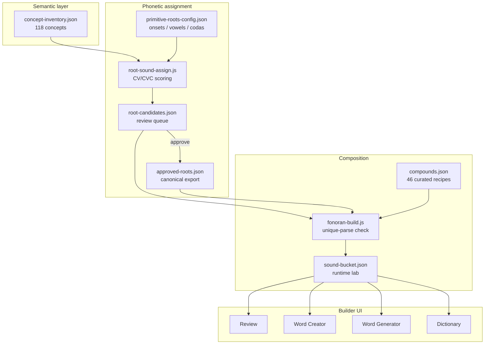

# Fonoran language guide

> **Start here** for the experimental Fonoran language and its builder at [`/fonoran/`](../fonoran/).

**Fonoran** is a constructed language written in the [Fonora phonetic script](platform-overview.md). You assign CV/CVC sounds to semantic concepts, compose roots into compound words, and approve what enters the live vocabulary. Human review is canonical: generators propose, you decide.

## Architecture



## Quick start

```bash
npm install
npm start
# http://localhost:8000/fonoran/

npm run fonoran:build    # assign roots + build curated compounds → lab
```

## App tools

| Tab | Auth | Purpose |
| --- | --- | --- |
| **Dictionary** | Public | Browse roots and words; word trees and family graphs |
| **Grammar** | Public | Language specification ([fonoran-grammar.md](fonoran-grammar.md)) |
| **Translator** | Public | English → Fonoran sentences (beta) |
| **Word Generator** | Sign-in | English phrase → ranked compound suggestions (beta; uses [WordNet](third-party.md)) |
| **Root Creator** | Sign-in | Manual CV/CVC syllables |
| **Word Creator** | Sign-in | Stack roots and approved words → save compound |
| **Concept Editor** | Sign-in | Edit concept gloss, aliases, and spelling |
| **Review** | Sign-in | **Root queue** (pending spellings) · **Roots** · **Words** · **Generated** |
| **Health** | Public | Readability scores and warnings |
| **Advanced** | Sign-in | Import build, Run DDA, lab reset |

**Language Explorer** (from Dictionary): derivation trees, “used in” lists, Mermaid family graphs. Read-only graph API, no sign-in.

## Language model

| Rule | Detail |
| --- | --- |
| **Primitive roots** | One syllable, CV or CVC. Stored in `bucket.sounds`. |
| **Words** | Stack roots and/or approved words. Stored in `bucket.compounds`. |
| **Nesting** | Approved word `kaso` can combine with root `la` → `lakaso`. |
| **Review states** | `draft` → `needs_review` → `approved` \| `rejected` \| `revised` |
| **Live vocabulary** | `data/fonoran-sound-bucket.json` (or PostgreSQL when `DATABASE_URL` is set) |

Legacy `parts: ["ka","so"]` is accepted; stored as typed `{ type, ref }` components.

```json
{ "type": "root", "ref": "ba" }
{ "type": "word", "ref": "cmp-..." }
```

Spelling = concatenation of component phonetic forms, left to right.

## Build pipeline {#pipeline}

One converged pipeline. **`npm run fonoran:build`** regenerates root spellings (locking approved ones), resolves curated compounds, validates unique segmentation, and imports into the lab.

```text
concept-inventory → root-candidates → review → fonoran:build → lab
```

| Step | What happens |
| --- | --- |
| 1. Build | `npm run fonoran:build` assigns CV/CVC spellings, builds compounds, imports lab |
| 2. Review | Open **Review** at `/fonoran/#review` — approve, reject, edit, or regenerate roots |
| 3. Rebuild | Re-run build; approved spellings stay locked; **user-created lab items are preserved** |

### Data files

| File | Role |
| --- | --- |
| `data/fonoran-concept-inventory.json` | 118 semantic concepts (no phonetics) |
| `data/fonoran-root-candidates.json` | Proposed spellings + review status |
| `data/fonoran-approved-roots.json` | Canonical approved roots |
| `data/fonoran-compounds.json` | 46 curated compound recipes |
| `data/fonoran-primitive-roots-config.json` | Phonetics rules only (onsets, vowels, codas) |
| `data/fonoran-sound-bucket.json` | Runtime lab: sounds, compounds, history |

### Commands

```bash
npm run fonoran:reset              # blank lab + review queue + canonical roots
npm run fonoran:build              # full pipeline → lab (needs review)
npm run fonoran:build:approved     # same, everything pre-approved (testing)
npm run fonoran:root-candidates    # refresh candidates only (no lab import)
```

Typical loop:

```bash
npm run fonoran:reset && npm run fonoran:build
# → Review at /fonoran/#review
# → npm run fonoran:build again after approving roots
```

### CV/CVC rule

Every primitive root is exactly **one syllable**: **CV** (`ba`, `te`) or **CVC** (`bel`, `dam`). Multi-syllable forms are compounds, not roots. Enforced at generation and at build time.

Reserved particles (never roots): `mi`, `na`, `ta`.

## API

### Lab (vocabulary)

| Endpoint | Method | Auth |
| --- | --- | --- |
| `/api/fonoran/lab` | GET | Public |
| `/api/fonoran/lab/health` | GET | Public |
| `/api/fonoran/lab/graph/:kind/:ref` | GET | Public |
| `/api/fonoran/lab/compounds` | POST | Sign-in |
| `/api/fonoran/lab/run-dda` | POST | Sign-in |
| `/api/fonoran/lab/build` | POST | Sign-in |

### Root review (file-backed)

| Endpoint | Method | Purpose |
| --- | --- | --- |
| `/api/fonoran/roots/candidates` | GET | List candidates (`?status=pending`) |
| `/api/fonoran/roots/candidates/:id` | PATCH | `{ action: approve\|reject\|edit\|reopen, … }` |
| `/api/fonoran/roots/candidates/:id/regenerate` | POST | New spelling for one concept |
| `/api/fonoran/roots/canonical` | GET | Approved root export |

### Other

| Endpoint | Method | Purpose |
| --- | --- | --- |
| `/api/fonoran/word-generator` | POST | English phrase → ranked compounds |
| `/api/fonoran/translate` | POST | English sentence → Fonoran |
| `/api/fonoran/concepts` | GET | Concept inventory + spellings |

## Credits

Word Generator semantic lookup uses **WordNet** (via **wordpos**). See [third-party.md](third-party.md) for full attribution and licenses.

## Related

- [fonoran-grammar.md](fonoran-grammar.md) — syntax and composition rules
- [fonoran-interpretive-translator.md](fonoran-interpretive-translator.md) — translator design
- [platform-overview.md](platform-overview.md) — three platform layers
- [deploy.md](deploy.md) — PostgreSQL and production hosting
- Legacy generators: [fonoran-generator-archive.md](fonoran-generator-archive.md)
