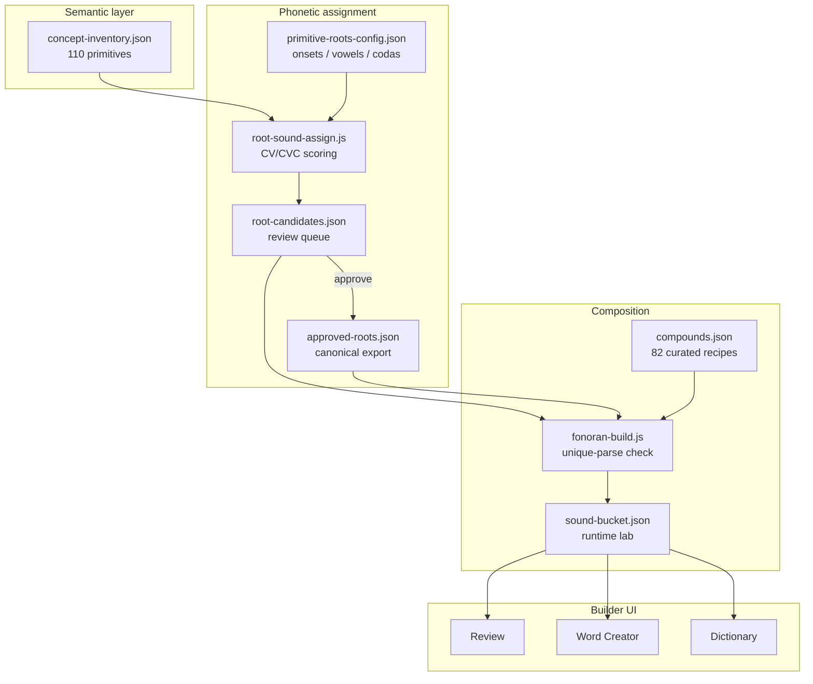

# Fonoran language guide

> **Read the research.** How this build pipeline was designed is told in the research notebook: [RN-13 · Concepts are canonical, sounds are editorial proposals](/research/notes/editorial-pipeline).

> **Start here** for the experimental Fonoran language and its builder at [`/language`](/language). To
> practice reading the script Fonoran is written in — Learn the Sounds, Breakdown, Samples — see
> [`/tools`](/tools) instead; this document covers the builder/lab side.
>
> **Why Fonoran exists:** it is an experiment in whether people from different native
> languages can communicate basic meaning by combining a small shared set of roots. The
> success metric is whether *another* root-knower can recover the intended meaning — not
> whether a compound is the most technically correct decomposition. Read the
> [Fonoran Constitution](fonoran-constitution.md) for the philosophy, the campfire test,
> and the tiered language model.

**Fonoran** is a constructed language written in the [Fonora phonetic script](platform-overview.md). You assign CV/CVC sounds to semantic concepts, compose roots into compound words, and approve what enters the live vocabulary. Human review is canonical: generators propose, you decide. Compounds are treated as **meaning-attempts** with a *preferred* form and tracked *alternate understandable* forms, not as single canonical answers.

## Architecture



## Quick start

```bash
npm install
npm start
# http://localhost:8000/language

npm run fonoran:build    # assign roots + build curated compounds → lab
```

## App tools

| Tab | Auth | Purpose |
| --- | --- | --- |
| **Dictionary** | Public | Browse roots and words; word trees and family graphs |
| **Grammar** | Public | Language specification ([fonoran-grammar.md](fonoran-grammar.md)) |
| **Translator** | Public | English → Fonoran sentences. Resolves via curated aliases, interpretation rules, and a single-concept WordNet fallback; unknown words surface as honest gaps (never fabricated). |
| **Root Creator** | Sign-in | Manual CV/CVC syllables |
| **Word Creator** | Sign-in | Stack roots and approved words → save compound |
| **Concept Editor** | Sign-in | Edit concept gloss, aliases, and spelling |
| **Review** | Sign-in | **Root queue** (pending spellings) · **Roots** · **Words** · **Generated** |
| **Health** | Public | Readability scores and warnings |
| **Advanced** | Sign-in | Import build, Run DDA, lab reset |

**Language Explorer** (from Dictionary): derivation trees, “used in” lists, Mermaid family graphs. Read-only graph API, no sign-in.

## Language model

| Rule | Detail |
| --- | --- |
| **Primitive roots** | One syllable, CV or CVC. Stored in `bucket.sounds`. |
| **Words** | Stack roots and/or approved words. Stored in `bucket.compounds`. |
| **Nesting** | Approved word `kaso` can combine with root `la` → `lakaso`. |
| **Review states** | `draft` → `needs_review` → `approved` \| `rejected` \| `revised` |
| **Live vocabulary** | PostgreSQL when `DATABASE_URL` is set; else `data/fonoran-sound-bucket.json` |

Legacy `parts: ["ka","so"]` is accepted; stored as typed `{ type, ref }` components.

```json
{ "type": "root", "ref": "ba" }
{ "type": "word", "ref": "cmp-..." }
```

Spelling = concatenation of component phonetic forms, left to right.

## Build pipeline {#pipeline}

One converged pipeline. **`npm run fonoran:build`** regenerates root spellings (locking approved ones), resolves curated compounds, validates unique segmentation, and imports into the lab.

**Guiding principle: concepts are canonical; sounds are editorial proposals until approved.** Generators propose, humans decide.

```text
meaning cleanup → primitive test → priority class → sound generation
  → distinctiveness + collision + boundary scoring → human approval → compounds
```

| Step | What happens |
| --- | --- |
| 1. Build | `npm run fonoran:build` assigns CV/CVC spellings, builds compounds, imports lab |
| 2. Review | Open **Review** at `/language#review` — approve, reject, edit, or regenerate roots |
| 3. Rebuild | Re-run build; approved spellings stay locked; **user-created lab items are preserved** |

### Concept metadata drives generation

Each concept in the inventory carries editorial metadata (seed defaults via `npm run fonoran:inventory-migrate`):

| Field | Purpose |
| --- | --- |
| `plain_description` | Everyday gloss shown in review (avoid academic wording) |
| `primitive_test_note` | Short rationale: is this a true primitive? |
| `suggested_status` | `primitive` \| `compound_candidate` \| `unclear` (semantic metadata, **not** a review state) |
| `priority_class` | `essential` \| `common` \| `useful` \| `extended` \| `questionable` |

`priority_class` maps to an internal weight (essential 100 → questionable 20) in `tools/fonoran-priority.js`. Concepts are assigned sounds in priority order, so the most important concepts pick the cheapest syllables first. **Compound candidates are ineligible for a root** while marked `compound_candidate` — they stay in the inventory and review queue for semantic review, and become eligible again the moment they are promoted to `primitive` (no code change). Review states stay `pending | approved | rejected`.

### Scoring layers

Every candidate syllable is scored on four stacked layers (all feed one penalty):

1. **Phonetic cost** — shorter, simpler syllables for higher-priority concepts.
2. **Phonetic distinctiveness** — spread the sound space so unrelated roots do not cluster (`ba/be/bi/bo`, `ban/dan/gan`).
3. **Editorial collision** — locale-specific profile (default English) that blocks profanity/reserved particles, discourages common words, and warns on homophones and particle near-misses. See `data/fonoran-collision-profiles/`.
4. **Compound-boundary flow** — penalizes spellings that would form awkward `mm`/`ll` joins with their likely compound partners.

Distinctiveness, collision, and boundary scores plus any warnings are surfaced per candidate in the Review UI. The `fi`/collective case: assignment follows priority weight + phonetic cost, not semantic fit — `fi` is now penalized as an English homophone of "fee".

### Data files

| File | Role |
| --- | --- |
| `data/fonoran-concept-inventory.json` | Semantic concepts + editorial metadata + experience/language tier + campfire pass (no phonetics) |
| `data/fonoran-root-candidates.json` | Proposed spellings + scores + warnings + review status + tier metadata |
| `data/fonoran-approved-roots.json` | Canonical approved roots (with experience/language tier + campfire pass) |
| `data/fonoran-compounds.json` | Curated compounds as ranked meaning-attempts: a `preferred` form + `alternates[]` with advisory `understandability` (see [constitution](fonoran-constitution.md)) |
| `data/fonoran-playtests.json` | Guess-the-meaning playtest rounds — the human authority that decides preferred forms |
| `data/fonoran-primitive-roots-config.json` | Phonetics rules + active `collision_profile` |
| `data/fonoran-collision-profiles/` | Editorial collision profiles (default `en.json`) |
| `data/fonoran-sound-bucket.json` | Runtime lab: sounds, compounds, history (seed + snapshot format) |
| `data/localizations/en.json` | English word banks per concept |

Runtime state is stored in **PostgreSQL** in production. JSON files are seeds and snapshot interchange format — update git milestones via `npm run fonoran:snapshot:export -- --to=data/`.

### Commands

```bash
npm run fonoran:reset              # blank lab + review queue + canonical roots
npm run fonoran:build              # full pipeline → lab (needs review)
npm run fonoran:build:approved     # same, everything pre-approved (testing)
npm run fonoran:root-candidates    # refresh candidates only (no lab import)
npm run fonoran:inventory-migrate  # seed editorial metadata fields on the concept inventory
npm run fonoran:snapshot:export -- --to=data/   # Postgres → seed JSON (commit milestones)
npm run fonoran:snapshot:import -- --from=data/ # seed JSON → Postgres (local bootstrap)
```

Typical loop:

```bash
npm run fonoran:reset && npm run fonoran:build
# → Review at /language#review
# → npm run fonoran:build again after approving roots
```

### Translator regression suite

[../data/fonoran-translation-tests.json](../data/fonoran-translation-tests.json)
is a golden corpus of ~100 canonical sentences, each with the exact `fon` output
the project commits to. Run it on every grammar/root/rule change so unexpected
drift is caught before it reaches the language (details in
[fonoran-grammar.md → Resolution cascade & golden regression suite](fonoran-grammar.md#rule-7-translator-architecture)):

```bash
npm run test:translator          # assert: FAIL on any drift from golden or new gap
npm run test:translator:update   # accept current output as the new golden baseline
node scripts/fonoran-translation-gaps.js   # full report: coverage, gaps, quality, collapses
```

`npm test` runs the unit suite **and** this golden regression automatically.

### CV/CVC rule

Every primitive root is exactly **one syllable**: **CV** (`ba`, `te`) or **CVC** (`bel`, `dam`). Multi-syllable forms are compounds, not roots. Enforced at generation and at build time.

Reserved particles (never roots): `mi`, `na`, `ta`.

## API

| Endpoint | Method | Auth | Purpose |
| --- | --- | --- | --- |
| `/api/fonoran/lab` | GET | Public | Lab bucket (sounds, compounds) |
| `/api/fonoran/lab/health` | GET | Public | Readability scores |
| `/api/fonoran/lab/graph/:kind/:ref` | GET | Public | Derivation / family graph |
| `/api/fonoran/lab/compounds` | POST | Sign-in | Save compound |
| `/api/fonoran/lab/run-dda` | POST | Sign-in | Run DDA inference (archive experiment) |
| `/api/fonoran/lab/build` | POST | Sign-in | Import build into lab |
| `/api/fonoran/roots/candidates` | GET | Sign-in | Root queue (`?status=pending`) |
| `/api/fonoran/roots/candidates/:id` | PATCH | Sign-in | Approve / reject / edit / reopen |
| `/api/fonoran/roots/candidates/:id/regenerate` | POST | Sign-in | New spelling for one concept |
| `/api/fonoran/roots/canonical` | GET | Public | Approved root export |
| `/api/fonoran/snapshot/status` | GET | Public | Storage mode and doc counts |
| `/api/fonoran/snapshot/export` | GET | Admin | Download full-state zip |
| `/api/fonoran/snapshot/preview` | POST | Sign-in | Preview zip before restore |
| `/api/fonoran/snapshot/import` | POST | Admin | Replace all state (`confirm: RESTORE`) |
| `/api/fonoran/translate` | POST | Public | English sentence → Fonoran |
| `/api/fonoran/concepts` | GET | Public | Concept inventory + spellings |

Auth and production release checklist: [fonoran-auth-and-release.md](fonoran-auth-and-release.md).

## Credits

The translator's semantic lookup uses **WordNet** (via **wordpos**). See [third-party.md](third-party.md) for full attribution and licenses.

## Related

- [fonoran-constitution.md](fonoran-constitution.md) — what Fonoran is for: the communication experiment, the campfire test, the tiered language
- [fonoran-grammar.md](fonoran-grammar.md) — syntax and composition rules
- [fonoran-interpretive-translator.md](fonoran-interpretive-translator.md) — translator design
- [platform-overview.md](platform-overview.md) — three platform layers
- [deploy.md](deploy.md) — PostgreSQL and production hosting
- Legacy generators: [fonoran-generator-archive.md](fonoran-generator-archive.md)
