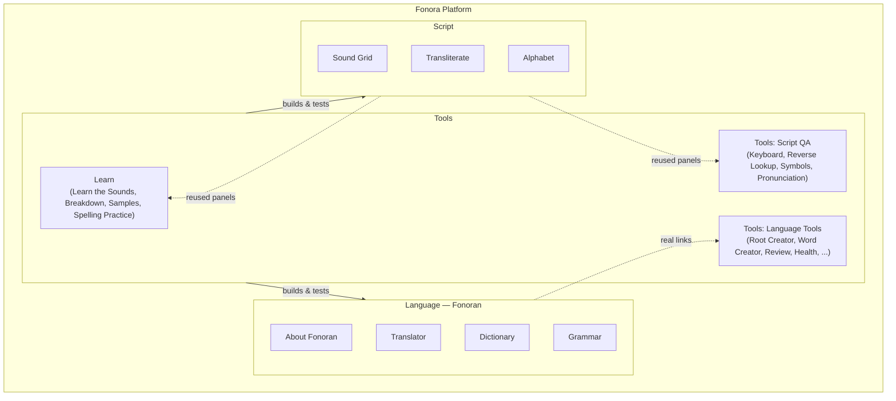

# Fonora platform overview

Fonora is an open research project exploring new approaches to writing systems, language
design, and language learning through open-source experiments.

**Our hypothesis:** can a language designed from first principles be learned quickly enough
that two people with no shared native language can achieve practical communication after only
a short period of study?

Fonora has three projects plus a public research notebook, surfaced as four top-level tabs (five when signed in):

| Tab | Route | What it is | Start here |
| --- | --- | --- | --- |
| **Fonora** | [`/`](/) | Platform home: the project, the hypothesis, research notebook | This document · [`/research`](/research) · [`/research/timeline`](/research/timeline) |
| **Script** | [`/script`](/script) | Fonora Script: phonetic writing system | [language-rules.md](language-rules.md) · [Sound Grid](/script#grid) |
| **Language** | [`/language`](/language) | Fonoran: experimental language built on Fonora Script | [fonoran-constitution.md](fonoran-constitution.md) · [fonoran.md](fonoran.md) |
| **Learn** | [`/learn`](/learn) | Learner-facing practice for Fonora Script | [`/learn`](/learn) · [Reading](/learn#reading) · [Writing](/learn#writing) |
| **Tools** | [`/tools`](/tools) | QA/build tooling for Script and Language (sign-in required when OAuth is configured) | [`/tools#tools-home`](/tools#tools-home) |

The **Fonora** sub-nav links to **About**, **Research**, **Timeline**, **Open Questions**, and **Docs**. The research notebook is the narrative layer of the project: each major experiment is written up as a standalone research note (question → hypothesis → constraints → implementation → outcome → next question), with a [visual timeline](/research/timeline) connecting them. The docs in this folder are the *reference* layer the notebook links to.

[`/learn`](/learn) is public learner-facing practice (Learn the Sounds, Breakdown, Samples,
Spelling Practice). [`/tools`](/tools) is QA/debugging (Keyboard Testing, Reverse Lookup,
Symbols, Pronunciation Testing/Validation, plus cards linking into the `/language` builder
tools). `/script`, `/learn`, and `/tools` are served by the same front-end bundle and reuse
the same panels — there is no duplicated tool logic. `/language` is a separate app (the
Fonoran vocabulary builder); Tools links directly into its pages (Root Creator, Word Creator,
Review, Health, ...) rather than duplicating them.

For the full Fonoran data pipeline (concepts → roots → compounds → lab), see the diagram in **[fonoran.md](fonoran.md)**.

## Front end vs. backend: this is a front-end split only

Script, Language, and Tools are split here as **navigation and presentation**, not as separate
backends. The Fonoran builder's data, API (`/api/fonoran/*`), and tooling remain shared and
intertwined by design — splitting the data model is explicitly out of scope for now. See
[fonoran.md](fonoran.md) for the (single, shared) data architecture.

## Start here

### Learn the script

1. [Sound Grid](/script#grid) and [Alphabet](/script#alphabet)
2. [Transliterate](/script#translator)
3. [language-rules.md](language-rules.md)

### Learn Fonoran

1. [fonoran-constitution.md](fonoran-constitution.md) — philosophy, the campfire test, the tiered language
2. [`/language`](/language) — About Fonoran, then Translator / Dictionary / Grammar
3. [`/learn`](/learn) — reading, breakdown, samples, and spelling practice
4. [fonoran-grammar.md](fonoran-grammar.md)

### Build the language

1. `npm start` → [`/language`](/language)
2. `npm run fonoran:build` — assign roots, build curated compounds, import lab
3. **Review** — approve roots and words (via [`/tools#tools-home`](/tools#tools-home) → Language Tools)
4. **Word Creator** — stack roots and approved words into compounds
5. **Health** / **Advanced** — scores and Run DDA

Details: [fonoran.md#pipeline](fonoran.md#pipeline).

---

## Data architecture

### Live vocabulary

**`data/fonoran-sound-bucket.json`** (gitignored locally) is authoritative for your language:

- `sounds[]` — primitive roots
- `compounds[]` — words, derivation trees, review state, DDA metadata
- `history[]` — undo stack

**`npm run fonoran:build`** rebuilds the lab from the concept inventory and curated compounds. User-created roots and words (`created_by: user`) are **preserved** across rebuilds.

### Concept and build files (committed)

| File | Role |
| --- | --- |
| `fonoran-concept-inventory.json` | Semantic concepts |
| `fonoran-root-candidates.json` | Root spellings + review queue |
| `fonoran-approved-roots.json` | Canonical approved roots |
| `fonoran-compounds.json` | Curated compound recipes |

### PostgreSQL

When `DATABASE_URL` is set, the lab can live in PostgreSQL. JSON is imported on first boot and remains the export format (`npm run fonoran:export`). See [deploy.md](deploy.md).

---

## Related

- Doc index: [README.md](README.md)
- Fonoran philosophy: [fonoran-constitution.md](fonoran-constitution.md)
- Third-party licenses: [third-party.md](third-party.md)
- Contributing: [../CONTRIBUTING.md](../CONTRIBUTING.md)
