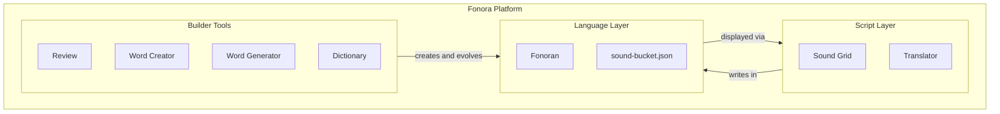

# Fonora platform overview

Fonora is a **platform** with three layers:

| Layer | What it is | Start here |
| --- | --- | --- |
| **Script Layer** | Fonora phonetic writing system | [language-rules.md](language-rules.md) · [Sound Grid](../#grid) |
| **Language Layer** | **Fonoran** experimental conlang | [fonoran.md](fonoran.md) · [Dictionary](../fonoran/#dictionary) |
| **Language Builder Tools** | Create, review, explore Fonoran | [fonoran.md](fonoran.md) · [`/fonoran/`](../fonoran/) |

For the full Fonoran data pipeline (concepts → roots → compounds → lab), see the diagram in **[fonoran.md](fonoran.md)**.

## Start here

### Learn the script

1. [Sound Grid](../#grid) and [Alphabet](../#alphabet)
2. [Translator](../#translator) and [Reader](../#reader)
3. [language-rules.md](language-rules.md)

### Explore Fonoran

1. [fonoran.md](fonoran.md)
2. [Dictionary](../fonoran/#dictionary)
3. [fonoran-grammar.md](fonoran-grammar.md)

### Build the language

1. `npm start` → [`/fonoran/`](../fonoran/)
2. `npm run fonoran:build` — assign roots, build curated compounds, import lab
3. **Review** — approve roots and words
4. **Word Creator** / **Word Generator** — add compounds
5. **Health** / **Advanced** — scores and Run DDA

Details: [fonoran.md#pipeline](fonoran.md#pipeline).

---

## Data architecture

### Live vocabulary

**`data/fonoran-sound-bucket.json`** (gitignored locally) is authoritative for your language:

- `sounds[]` — primitive roots
- `compounds[]` — words, derivation trees, review state, DDA metadata
- `history[]` — undo stack

**`npm run fonoran:build`** rebuilds the lab from the concept inventory and curated compounds. User-created roots and words (`created_by: user`) are **preserved** across rebuilds.

### Concept and build files (committed)

| File | Role |
| --- | --- |
| `fonoran-concept-inventory.json` | Semantic concepts |
| `fonoran-root-candidates.json` | Root spellings + review queue |
| `fonoran-approved-roots.json` | Canonical approved roots |
| `fonoran-compounds.json` | Curated compound recipes |

### PostgreSQL

When `DATABASE_URL` is set, the lab can live in PostgreSQL. JSON is imported on first boot and remains the export format (`npm run fonoran:export`). See [deploy.md](deploy.md).

---

## Related

- Doc index: [README.md](README.md)
- Third-party licenses: [third-party.md](third-party.md)
- Contributing: [../CONTRIBUTING.md](../CONTRIBUTING.md)
