# Fonora platform overview

Fonora is more than a single app — it is a **platform** with three conceptual layers that work together:

| Layer | What it is | Start here |
| --- | --- | --- |
| **Script Layer** | The Fonora phonetic writing system — symbols, encoding rules, transliteration | [language-rules.md](language-rules.md) · [Sound Grid](../#grid) |
| **Language Layer** | **Fonoran** — an experimental constructed language written in Fonora | [fonoran.md](fonoran.md) · [Dictionary](../fonoran/#dictionary) |
| **Language Builder Tools** | Suite for creating, reviewing, testing, and exploring Fonoran | [fonoran.md](fonoran.md) · [Root Creator](../fonoran/) |

```mermaid
flowchart TB
  subgraph platform [Fonora Platform]
    subgraph script [Script Layer]
      SG[Sound Grid]
      SYM[Symbols]
      ER[Encoding Rules]
      TR[Transliteration]
    end
    subgraph language [Language Layer]
      FL[Fonoran Language]
      RW[Root Words]
      CP[Compounds]
      DDA[DDA Semantics]
      DICT[Dictionary]
    end
    subgraph builder [Language Builder Tools]
      RC[Root Creator]
      CC[Compound Creator]
      RT[Review Tools]
      SM[Story Mode]
      LE[Language Explorer]
      SA[Semantic Analysis]
    end
  end
  script -->|"writes in"| language
  builder -->|"creates and evolves"| language
  language -->|"displayed via"| script
```



## Definitions

### Fonora (the script)

**Fonora** is an open-source **phonetic writing system** built from nine core symbols that represent where and how speech sounds are produced. Any language can be *transliterated* into Fonora using the IPA pipeline:

```
Text → eSpeak NG → IPA → ipa-normalize.js → encodeSounds() → Fonora symbols
```

Rules version: **v3** ([language-rules.md](language-rules.md) — vowel grammar `⚬X`, diphthong `⚬XᵔY`).

### Fonoran (the language)

**Fonoran** is an **experimental constructed language** built *using* Fonora. It has its own vocabulary — primitive root syllables, compound words, meanings, and a semantic coordinate system (DDA). Fonoran roman spellings are displayed in Fonora script via the Fonora bridge.

### Language Builder Tools

The **Language Builder Tools** are the interactive suite at [`/fonoran/`](../fonoran/) (plus related CLI commands) used to create roots, compose words, run review workflows, explore derivation trees, and analyze semantic health.

---

## Start here — three audiences

### I want to learn the script

1. [Sound Grid](../#grid) — place × manner reference
2. [Alphabet](../#alphabet) — primary symbols and phoneme inventory
3. [Translator](../#translator) and [Reader](../#reader) — transliterate and listen
4. [language-rules.md](language-rules.md) — authoritative encoding rules
5. [Quiz](../#quiz) — practice decode and construct modes

### I want to explore Fonoran

1. [fonoran.md](fonoran.md) — language model and vocabulary rules
2. [Dictionary](../fonoran/#dictionary) — browse roots and compounds
3. [fonoran-gen3.md](fonoran-gen3.md) — DDA semantic reference (Depth, Mode, Aspect)
4. [fonoran-gen3-1.md](fonoran-gen3-1.md) — phonetic distinctiveness layer

### I want to build the language

1. Open [`/fonoran/`](../fonoran/) after `npm start`
2. **Root Creator** — create primitive syllables (CV / CVC)
3. **Compound Creator** — stack roots and approved words
4. **Review** — approve, reject, or revise pending items
5. **Language Explorer** — derivation trees and family graphs (from Dictionary or Roots)
6. **Semantic Analysis** — Health overlay and **Run DDA** in Advanced

---

## Platform map

| Layer | Live tools | Key docs |
| --- | --- | --- |
| **Script** | Sound Grid, Alphabet, Translator, Reader, Breakdown, Samples, Quiz, Keyboard, Reverse Lookup, Pronunciation Testing/Validation | [language-rules.md](language-rules.md), [IPA-PIPELINE-REPORT.md](IPA-PIPELINE-REPORT.md), [multilingual-support.md](multilingual-support.md) |
| **Language** | Dictionary (`/fonoran/`), DDA reference data | [fonoran.md](fonoran.md), [fonoran-gen3.md](fonoran-gen3.md), [fonoran-gen3-1.md](fonoran-gen3-1.md) |
| **Builder** | Root Creator, Compound Creator, Review, Language Explorer, Health, Advanced | [fonoran.md](fonoran.md), [fonoran-generator-archive.md](fonoran-generator-archive.md) |
| **Platform** | Home, Open Problems, Docs viewer | [open-problems.md](open-problems.md), [deploy.md](deploy.md) |

**Story Mode** (passage reading with vocabulary feedback) was an earlier experiment — removed during cleanup. See [fonoran-generator-archive.md](fonoran-generator-archive.md) for recovery notes. A nav slot is reserved for a future restoration.

---

## Data architecture

### Live language (your vocabulary)

Your working Fonoran vocabulary is stored in **`data/fonoran-sound-bucket.json`** (gitignored locally):

- `sounds[]` — primitive roots
- `compounds[]` — composed words with derivation trees, meanings, review state, DDA metadata
- `history[]` — undo stack

This file is **authoritative for your language**. Reference generator data never overwrites it.

### Reference semantics (read-only seeds)

Committed JSON under `data/` provides DDA coordinates, Gen 3/3.1 inventories, and canonical primitive registry — used for:

- English meaning picker suggestions
- DDA inference (`Run DDA`)
- Health scoring algorithms
- Offline generator audits (`npm run fonoran:gen3:*`)

### Storage migration (PostgreSQL)

The platform is moving live lab data to **PostgreSQL** when `DATABASE_URL` is set:

- Local JSON is **imported, not deleted** — on first boot with an empty database, the server imports `fonoran-sound-bucket.json` if present
- JSON remains the portable **backup/export** format (`npm run fonoran:export`)
- Without `DATABASE_URL`, the app falls back to JSON file storage (`FONORAN_STORAGE=json`)

See [deploy.md](deploy.md) for PostgreSQL setup.

### Fonora script rules

[`language-rules.md`](language-rules.md) is loaded at runtime by both the main Fonora app and the Fonoran TTS bridge. Edit this file to change symbols, the sound grid, and vowel mappings.

---

## Related documentation

- Full index: [docs/README.md](README.md)
- Project README: [../README.md](../README.md)
- Contributing: [../CONTRIBUTING.md](../CONTRIBUTING.md)
